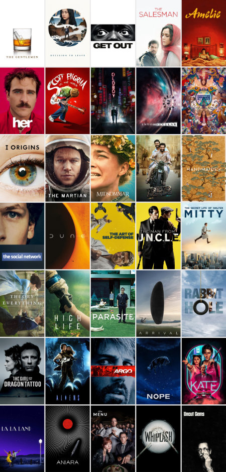

# letterboxdHueSort

A utility that automatically sorts films in a letterboxd list by poster colour.
\
\
Given a CSV file that was generated by the Letterboxd exporter (or that fits Letterboxd's [import format](https://letterboxd.com/about/importing-data/)), the program
\
outputs an identical CSV file, except that films are sorted by the colour of their posters.

## Inspiration for the project

Inspiration for this project came from browsing a number of visually appealing, user-generated
\
film lists on [Letterboxd](https://letterboxd.com/), a popular film discovery website.
\
The lists in question often contain films in the hundreds, and even thousands.
\
Here are only a few of these publicly available lists:

- [Movie posters sorted by color](https://letterboxd.com/sprudelheinz/list/movie-posters-sorted-by-color/) by Sprudelheinz
- [Horror Movie Posters Organized by Color](https://letterboxd.com/cwspnn/list/horror-movie-posters-organized-by-color-1/) by  fanny 🕷
- [My Favorite Films (Sorted by Color*)](https://letterboxd.com/cinemacardboard/list/my-favorite-films-sorted-by-color/) by  Cinematic Cardboard
- [my favorite movies but organized by color](https://letterboxd.com/rachel_remeny/list/my-favorite-movies-but-organized-by-color/) by  rachel remeny

Manually ordering movie posters from a list of 50 films is hard enough.
\
Manually ordering movie posters from a list of a few thousand films is a nightmare to say the least.

## Examples

For a visual representation of this type of "hue sorting" (aside from the letterboxd examples listed above), here is a **manually sorted**
\
representation of movie posters from the `test_images` folder.
\
\

\
\
_Note_: The film posters above are just a visual aid, and not actually output from the letterboxdHueSort program.
\
The sort order of the letterboxdHueSort program will differ from the above manually generated order.
